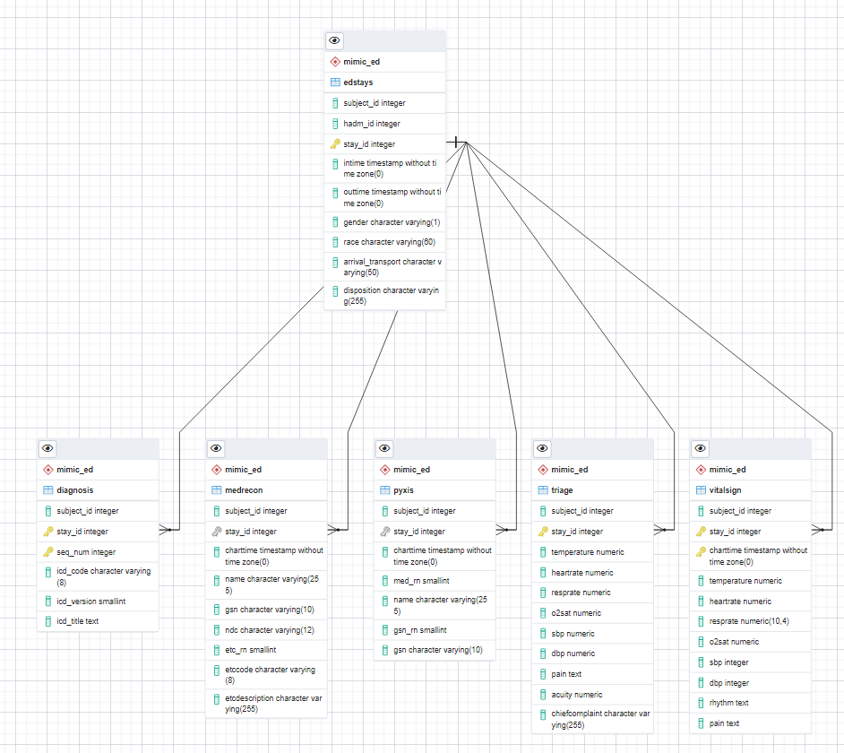

# Extracting event logs from MIMIC-IV and MIMIC-IV ED

## Usage

The following SQL scripts are designed for PostgreSQL. If you are using other SQL database, you can adapt them freely under MIT license.

> The schame name used in scripst:
`ed` module   --> `"mimic_ed"`
event log       --> `"mimic_insights"`

- [1_preprocessing.sql](./1_preprocessing.sql): preprocessing the `ed` moudle and preparing for converting them to activities with timestamps
- [2_to_activity.sql](./2_to_activity.sql): converting the processed tables in `ed` module into activity tables
- [3_to_eventlog.sql](./3_to_eventlog.sql): combining all activity tables into a whole event log

## ER diagram 

