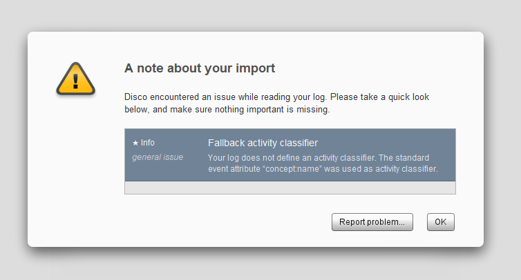

# MIMICEL: MIMIC-IV Event Log for Emergency Department

[](https://opensource.org/licenses/MIT)

## Abstract
In this work, we extract an event log from the MIMIC-IV-ED datasets by adopting an existing event log generation methodology, and we name this event log MIMICEL. The data tables in the existing datasets relate to each other based on the relational database schema and each table records the individual activities of patients along their journey in the emergency department (ED). While the MIMIC-IV-ED datasets catch snapshots of a patient journey in the ED, the extracted event log MIMICEL aims to capture an end-to-end process of the patient journey. This will enable us to analyse the existing patient flows, thereby improving the efficiency of an ED process.
## Prerequisite

1. PostgreSQL >= 11
    Loading MIMIC-IV-ED into a PostgreSQL database, referring to:
    - [MIMIC-IV-ED Loading Scripts](https://github.com/MIT-LCP/mimic-code/tree/main/mimic-iv-ed/buildmimic/postgres)

2. Python >= 3.7,
    Reuqired packages:
    - `pm4py`
    - `pandas`
    - `jupyterlab`


## Usage

### [1_extarct_eventlog](./1_extract_eventlog/)

This part is operated by PostgreSQL for extracting the event log from MIMIC-IV database, involving module `ed`.

The SQL scripts are designed for PostgreSQL. If you are using other SQL database, you can adapt them freely under MIT license.

- [1_preprocessing.sql](./1_extract_eventlog/1_preprocessing.sql): preprocessing the `ed` moudle and preparing for converting them to activities with timestamps
- [2_to_activity.sql](./1_extract_eventlog/2_to_activity.sql): converting the processed tables in `ed` module into activity tables
- [3_to_eventlog.sql](./1_extract_eventlog/3_to_eventlog.sql): combining all activity tables into a whole event log

### [2_to_xes](./2_to_xes/)

This part is running on Python environment. Here provides both `.py` and jupyter notebook for converting `.csv` file to `.xes` file.

## About the dataset

### XES event log

XES is a XML-based format event log. In specific, ``eXtensible Event Stream" (XES) is the standard format for logging events that can be supported by the majority of process mining tools. XES has become an official IEEE standard in 2016. XES maintains the general structure of an event log. In particular, an event log is composed of a set of traces, each containing a sequence of events. In addition, XES records trace-level and event-level attributes and their corresponding values in the event log, as illustrated in the following schema.

```xml
<trace>
    <!-- Trace attributes -->
    <event>
        <!-- Event attributes -->
    </event>
    ...
</trace>
```

In our settings, we use standard name labels in XES standard for CaseID, activity, timestamp and case attributes:

- Case ID --> case:concept:name
- Activity --> concept:name
- Timestamps --> time:timestamp
- Case attributes -->  start with `case:`

When importing XES file into [Disco](https://fluxicon.com/disco/), it might notify the warning about the activity classifier. You can ignore the message since we are using standard classifier.



## ChangeLog

Check [CHANGELOG.md](./CHANGELOG.md)